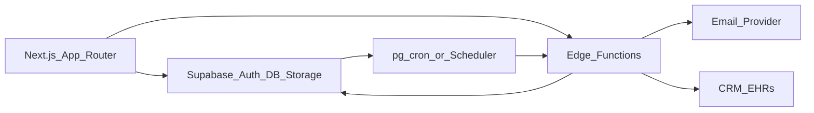

# HavenApply — Backend Architecture

Supabase-centric backend: Auth + Postgres + Storage + Edge Functions + Realtime + transactional outbox.

---

## Responsibilities

| Layer | Responsibility |
| --- | --- |
| **Next.js client** | UI; Supabase JS for RLS-safe reads/simple writes |
| **RPC (SQL)** | Search, dashboards, intake queues, application packet views |
| **Edge Functions** | AuthZ-heavy mutations, Storage signed URLs, webhooks, IA, outbox dispatch |
| **Triggers** | `updated_at`, profile bootstrap, status→timeline, status→outbox, touch `last_activity_at` |
| **Realtime** | `messages`, `notifications`, `application_timeline` (filtered channels) |
| **Cron / scheduler** | `dispatch-outbox`, expire invites, expire IA analyses, retention jobs |

---

## Mutation policy

**Use Edge Function or SECURITY DEFINER RPC** for:

- Submit / withdraw application
- Community accept / decline / request info / propose tour
- Create signed upload / download
- Invites (family + community)
- Generate compatibility analysis
- Outbox dispatch & inbound webhooks

**Allow direct client CRUD (RLS)** for:

- Draft senior profile fields
- Favorites / comparisons
- Task title/status within family
- Notification `read_at`
- Community profile drafts (staff with permission)

---

## Edge Functions

See [`supabase/functions/_index.md`](../../supabase/functions/_index.md) for request/response contracts.

| Function | Trigger |
| --- | --- |
| `create-signed-upload` | Family uploads document |
| `create-signed-download` | Authorized download + access log |
| `submit-application` | Family send |
| `withdraw-application` | Family withdraw |
| `community-application-action` | Staff decision / request / tour |
| `invite-family-member` / `accept-invite` | Collaboration |
| `invite-community-member` | Org/site staffing |
| `dispatch-outbox` | Cron every N seconds |
| `inbound-webhook` | Provider HTTP callbacks |
| `generate-compatibility` | On-demand or batch |
| `search-communities` | Optional thin wrapper over SQL RPC |

---

## Transactional outbox

On critical domain events (especially `applications.status` changes):

1. Same DB transaction updates row + inserts `application_timeline` + inserts `outbox_events` with `idempotency_key`.
2. `dispatch-outbox` claims pending rows (`FOR UPDATE SKIP LOCKED`), delivers email/CRM/webhooks, marks `sent` or retries with backoff.
3. After max attempts → `dead` + alert.

**Never** send CRM/email synchronously inside the user request path.

### Event types (initial)

| `event_type` | Consumers |
| --- | --- |
| `application.submitted` | Email family, notify community staff, CRM |
| `application.status_changed` | Email, CRM, Realtime fan-out |
| `application.withdrawn` | Community + CRM |
| `document.shared` | Community notification |
| `message.created` | Push/email digest (later) |
| `tour.proposed` | Family notification |
| `integration.sync_requested` | Provider adapters |

---

## Storage

Buckets defined in [`supabase/storage/buckets.sql`](../../supabase/storage/buckets.sql).

| Bucket | Path pattern |
| --- | --- |
| `senior-documents` | `{family_id}/{senior_id}/{document_id}/v{version}` |
| `message-attachments` | `{conversation_id}/{message_id}/{filename}` |
| `community-media` | `{organization_id}/{community_id}/{asset_id}` |
| `exports` | `{user_id}/{export_id}` (short TTL) |

Flow:

1. Client calls `create-signed-upload` → AuthZ → returns signed PUT + `documents` row (`status=uploading`).
2. Client uploads to Storage.
3. Client confirms → `status=ready` + checksum.
4. Downloads always via `create-signed-download` (never public PHI URLs).

---

## Realtime

Subscribe with RLS-enforced channel filters:

- Family: `notifications:user_id=eq.{uid}`
- Application thread: `messages:conversation_id=eq.{id}`
- Timeline: `application_timeline:application_id=eq.{id}`

Staff and family must not share broad `*` channels.

---

## Search

Primary: SQL RPC `search_communities`:

- PostGIS radius (`ST_DWithin`)
- FTS (`search_tsv @@ websearch_to_tsquery`)
- Filters: care level/services, price band, state, verified

Secondary (later): sync to Algolia/Meilisearch via outbox `community.reindexed`.

Semantic: `pgvector` on `community_embeddings` / `senior_embeddings`.

---

## Secrets & integrations

- Provider OAuth tokens / API keys → Supabase Vault (or encrypted column referenced by `organization_integrations.credentials_ref`)
- Never store raw secrets in `config` JSONB
- Inbound webhooks verify signatures before insert `webhook_events`

---

## Jobs & retention

| Job | Cadence | Action |
| --- | --- | --- |
| `dispatch-outbox` | 5–15s | Deliver pending outbox |
| `expire-invitations` | hourly | Mark expired family/community invites |
| `expire-analyses` | daily | Flag expired `compatibility_analyses` |
| `purge-exports` | daily | Delete Storage exports past TTL |
| `partition-maintenance` | monthly (phase 2) | Create next partitions |

---

## Error handling

- Edge Functions return structured `{ ok, error, code }`
- Idempotent submits: unique active application per `(senior_id, community_id)` where status not terminal
- Double-click safe via idempotency keys on Edge + outbox

---

## Local → production backends

Feature flag (app): `DATA_BACKEND=local|supabase`  
See [MIGRATION_FROM_PROTOTYPE.md](./MIGRATION_FROM_PROTOTYPE.md).
