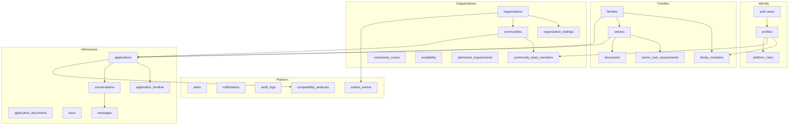

# HavenApply — Data Model

**Product:** HavenApply (Common Application for senior living, US)  
**Target scale:** ~10M families · ~50k communities · ~500 organizations · hundreds of thousands of applications / month  
**Auth:** Supabase Auth (`auth.users`)  
**Database:** PostgreSQL (Supabase) + PostGIS + FTS + pgvector  

This document is the canonical schema reference. SQL lives in [`supabase/migrations/`](../../supabase/migrations/).

---

## Design principles

1. **Domain separation** — identity, families, seniors, documents, organizations/communities, applications, messaging, platform (tasks/notifications/audit), AI, integrations, marketplace stubs.
2. **Contextual roles** — no exclusive `profiles.role`. Membership is via `family_members`, `community_team_members`, `organization_roles`, `platform_roles`.
3. **Multi-tenant communities** — `organizations` → `communities` → site resources + local team.
4. **No durable `file_url`** — Storage paths + signed URLs only.
5. **Search is not a table** — PostGIS + FTS (+ pgvector later); optional Algolia/Meilisearch later.
6. **Integration-ready** — outbox, webhook events, provider bindings from day one.
7. **IA scores are versioned analyses** — recalculable; never the sole source of truth on `applications`.

---

## Domain map



### Organization hierarchy

```text
organizations (Brookdale Senior Living)
  ├── organization_settings
  ├── organization_roles / organization_integrations
  └── communities (Dallas #1, Austin, …)
        ├── community_team_members
        ├── services / amenities / rooms
        ├── admission_requirements
        ├── availability
        └── applications (inbound)
```

---

## Naming & versioning conventions

| Concern | Convention |
| --- | --- |
| Tables | `snake_case`, plural (`applications`) |
| Primary key | `id uuid` (default `gen_random_uuid()`) |
| Foreign keys | `{table_singular}_id` |
| Timestamps | `*_at timestamptz` UTC |
| Soft delete | `deleted_at timestamptz` |
| Enums | `{domain}_{attribute}` e.g. `application_status` |
| Migrations | `supabase/migrations/YYYYMMDDHHMMSS_description.sql` (repo uses ordered `000N_` prefixes) |
| Care assessment schema | `senior_care_assessments.schema_version int` |
| IA algorithm | `compatibility_analyses.version` text semver (`2026.07.1`) |
| Org feature flags | `organization_settings.schema_version int` |

---

## Enums

| Enum | Values |
| --- | --- |
| `profile_status` | `active`, `invited`, `suspended`, `deleted` |
| `platform_role` | `super_admin`, `ops`, `support`, `moderator` |
| `family_member_role` | `owner`, `editor`, `viewer`, `medical`, `financial` |
| `invitation_status` | `pending`, `accepted`, `revoked`, `expired` |
| `organization_status` | `draft`, `active`, `suspended`, `closed` |
| `community_status` | `draft`, `pending_review`, `verified`, `suspended`, `closed` |
| `community_team_role` | `org_admin`, `admissions_manager`, `admissions_staff`, `readonly` |
| `organization_role_kind` | `billing_admin`, `crm_admin`, `analytics_viewer`, `org_owner` |
| `document_status` | `uploading`, `ready`, `quarantined`, `expired`, `deleted` |
| `document_category` | `id`, `insurance`, `medical`, `financial`, `legal`, `application`, `other` |
| `application_status` | `draft`, `submitted`, `received`, `under_review`, `more_info`, `tour_requested`, `assessment_requested`, `waitlisted`, `conditionally_approved`, `approved`, `offer_received`, `declined`, `withdrawn`, `closed` |
| `tour_status` | `proposed`, `confirmed`, `completed`, `cancelled`, `no_show` |
| `task_status` | `open`, `in_progress`, `done`, `cancelled` |
| `task_priority` | `low`, `medium`, `high`, `urgent` |
| `outbox_status` | `pending`, `processing`, `sent`, `failed`, `dead` |
| `webhook_direction` | `inbound`, `outbound` |
| `webhook_status` | `received`, `processed`, `failed`, `ignored` |
| `integration_status` | `disconnected`, `connecting`, `active`, `error`, `paused` |
| `support_level` | `mostly_independent`, `light_assisted`, `assisted_living`, `memory_care`, `skilled_nursing` |

---

## Tables by domain

### 1. Identity

#### `profiles`
One row per `auth.users` id. **No exclusive product role.**

| Column | Type | Notes |
| --- | --- | --- |
| `id` | uuid PK | = `auth.users.id` |
| `first_name`, `last_name` | text | |
| `email` | text | denormalized from auth |
| `phone` | text | |
| `avatar_url` | text | public avatar only (not PHI docs) |
| `status` | `profile_status` | |
| `last_login_at` | timestamptz | |
| `created_at`, `updated_at` | timestamptz | |

#### `platform_roles`
Haven internal staff. `(user_id, role)` unique.

---

### 2. Families

#### `families`
Collaboration unit owning seniors and applications.

#### `family_members`
`(family_id, user_id)` unique · `role` · `invitation_status` · `permissions` JSONB.

#### `family_invitations`
Email invite tokens · `expires_at` · `accepted_at`.

---

### 3. Seniors

#### `seniors`
Identity, address, living situation, move timeline, preferred locations JSONB, budget, funding, `completed_percentage`, `family_id`, `created_by`.

#### `senior_care_assessments`
**One row per senior.** JSONB: `mobility`, `adl`, `medications`, `cognition`, `health_conditions`, `behavior`, `preferences` · `support_level` · `ai_summary` · `schema_version`.

#### `senior_medical_conditions` / `medications` / `allergies`
Normalized for filters and matching (complement JSONB, do not replace it).

---

### 4. Documents

#### `documents`
| Column | Notes |
| --- | --- |
| `bucket`, `storage_path` | Required — no `file_url` |
| `mime_type`, `byte_size`, `checksum_sha256`, `version` | Integrity |
| `category`, `status`, `expires_at` | Lifecycle |

#### `document_access`
Share grant scoped to `application_id` (and optional `community_id`).

#### `document_access_logs`
Download / view audit.

---

### 5. Organizations & communities

#### `organizations` / `organization_settings` / `organization_roles`
Global billing, CRM prefs, analytics flags live in settings JSONB + typed columns as needed.

#### `communities`
Site-level: address, `location geography(Point,4326)`, slug unique per org, verified, pricing summary, FTS vector.

#### `community_services` · `community_amenities` · `community_rooms` · `admission_requirements` · `availability`

#### `community_team_members`
`organization_id` required · `community_id` **nullable** (NULL = org-wide) · `role` · status.

---

### 6. Shortlist

`favorites` · `comparisons` · `comparison_items`  
Search is **RPC** (`search_communities`), not a domain table.

---

### 7. Applications

#### `applications`
`family_id`, `senior_id`, `community_id`, **`organization_id` (denormalized)**, `submitted_by`, `status`, `completion_percentage`, `submitted_at`, `last_activity_at`, `batch_id`, optional `compatibility_score_cached` + `compatibility_analysis_id`.

#### `application_documents` · `application_questions` · `application_timeline` (append-only) · `application_status_history`

---

### 8–11. Messaging · Tours · Tasks · Notifications

- `conversations` — unique `application_id` preferred  
- `messages` + `message_reads`  
- `tours`  
- `tasks`  
- `notifications`

---

### 12. Admin

`audit_logs` — immutable platform audit (`actor_id`, `action`, `resource_type`, `resource_id`, `ip`, `metadata`).

V1 uses a single `audit_logs` table with `visibility` (`internal` | `support`) instead of a separate `activity_logs` table.

---

### 13. AI

#### `compatibility_analyses`
`score`, `version`, `weights` JSONB, `reasoning` JSONB, `model`, `generated_at`, `expires_at`.

#### `ai_summaries`
Versioned senior dossier summaries.

#### Embeddings (scale path)
`community_embeddings` · `senior_embeddings` — `vector` columns, not on hot OLTP rows.

---

### 14. Marketplace (stubs)

`partners` · `partner_services` · `referrals` · `quotes` — FK-ready, empty of product logic in V1.

---

### 15. Integrations

`integration_providers` · `organization_integrations` · `webhook_events` · `integration_logs` · `outbox_events`  
Outbox fields: `aggregate_type`, `aggregate_id`, `event_type`, `payload`, `idempotency_key`, `status`, `attempts`, `next_attempt_at`.

---

## Indexes (summary)

- Tenant-aligned composites: `(family_id, created_at DESC)`, `(community_id, status, last_activity_at DESC)`, `(organization_id, …)`
- Partial: active applications, unread notifications, pending outbox
- Uniques: `(organization_id, slug)`, `(family_id, user_id)`, site team `(community_id, user_id)` where community set
- PostGIS GIST on `communities.location`
- GIN on `communities.search_tsv`
- HNSW/IVFFlat on embedding tables (when populated)

**Partitioning (phase 2):** `application_timeline`, `messages`, `audit_logs`, `outbox_events` — monthly or by `organization_id` hash. V1 keeps single tables with stable column names for later `ATTACH PARTITION`.

---

## Golden rule

Sensitive data (PHI, documents, applications) is always scoped by `family_id` **or** `organization_id` / `community_id`, and enforced by RLS helpers — never globally readable.
